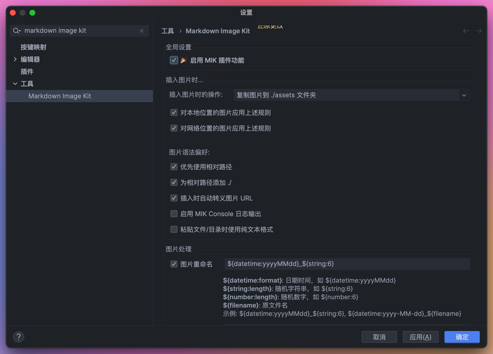
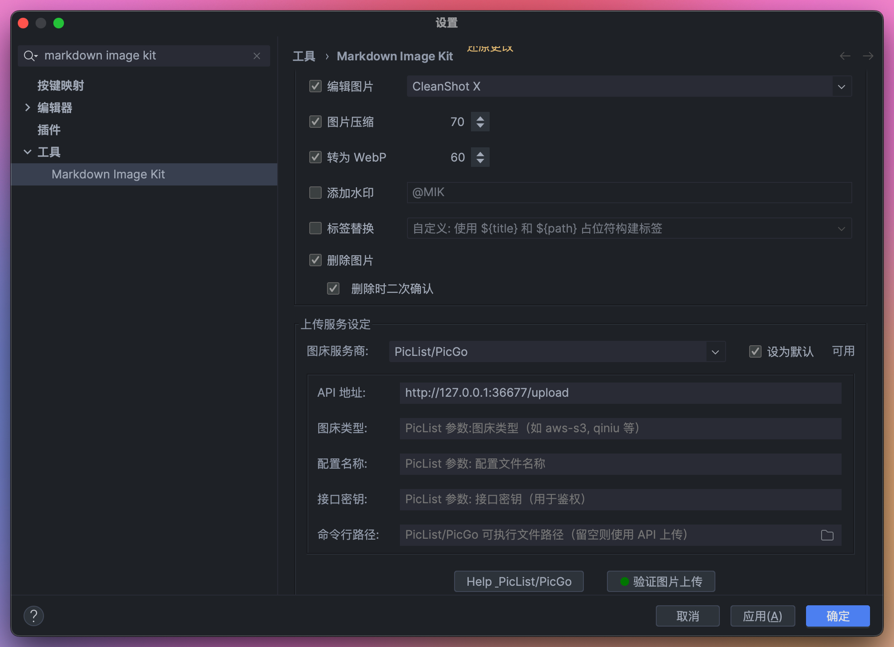
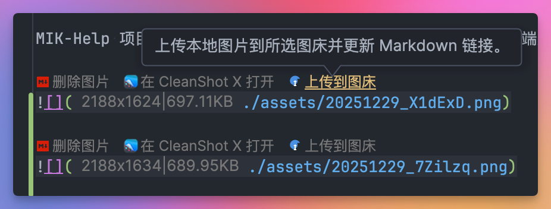
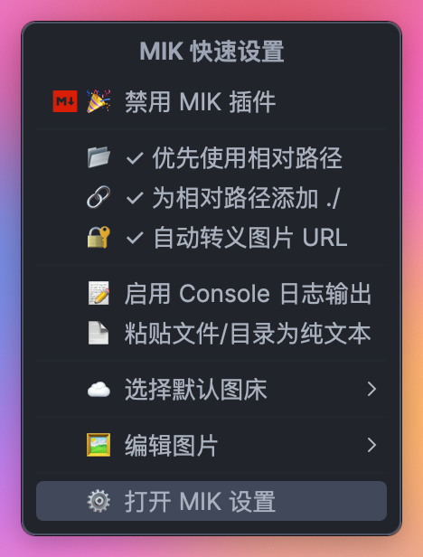
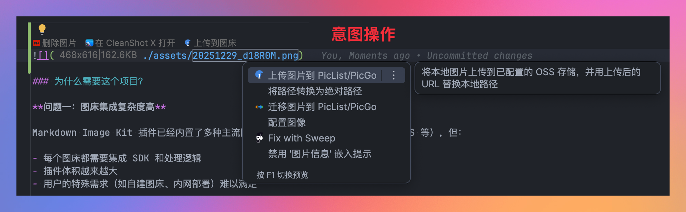
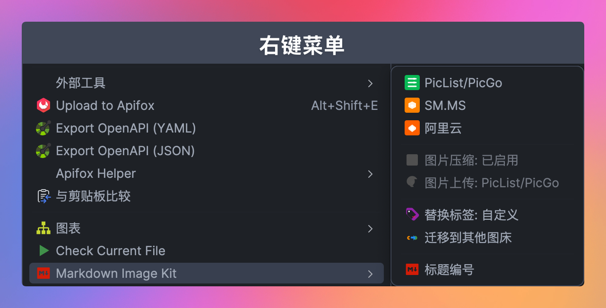
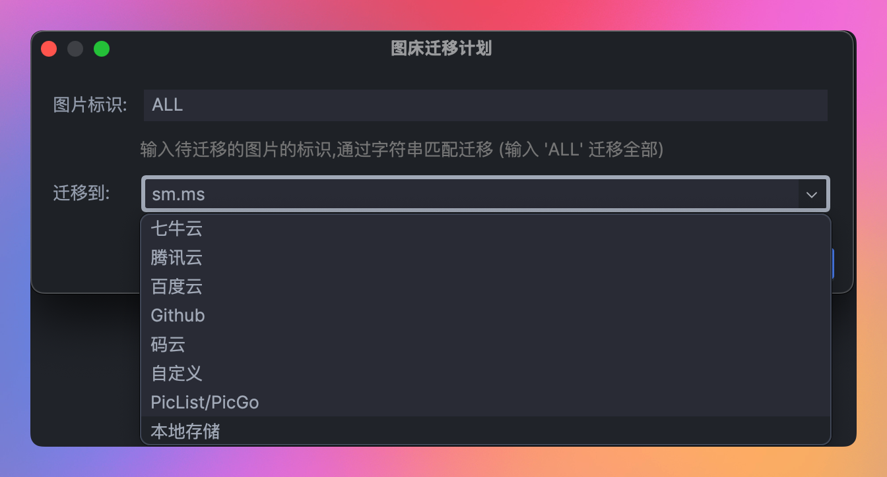
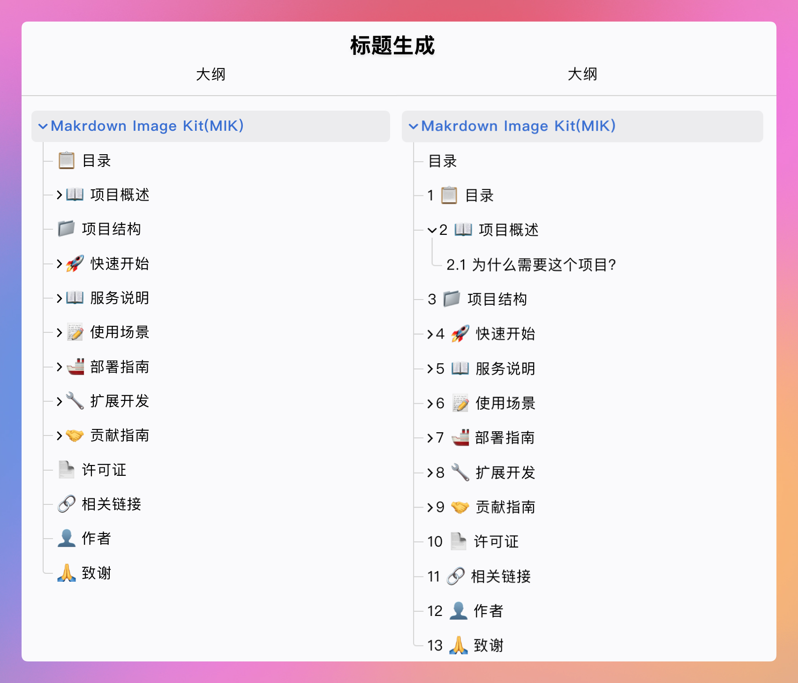

# Makrdown Image Kit(MIK)

[](https://opensource.org/licenses/MIT)
[](https://www.java.com/)
[](https://nodejs.org/)

[Markdown Image Kit](https://github.com/dong4j/markdown-image-kit) 插件的配套服务集合，包含以下内容：

1. **Upload API** - 多语言实现的自定义图床上传接口示例
2. **Help API** - 动态帮助文档 URL 服务
3. **Docs** - 基于 Docsify 的用户手册文档站点

## 目录

- [1 📋 目录](#1-📋-目录)
- [2 📖 项目概述](#2-📖-项目概述)
- [3 📁 项目结构](#3-📁-项目结构)
- [4 🚀 快速开始](#4-🚀-快速开始)
- [5 📖 服务说明](#5-📖-服务说明)
- [6 📝 使用场景](#6-📝-使用场景)
- [7 🚢 部署指南](#7-🚢-部署指南)
- [8 🔧 扩展开发](#8-🔧-扩展开发)
- [9 🤝 贡献指南](#9-🤝-贡献指南)
- [10 📄 许可证](#10-📄-许可证)
- [11 🔗 相关链接](#11-🔗-相关链接)
- [12 👤 作者](#12-👤-作者)
- [13 🙏 致谢](#13-🙏-致谢)

## 2 📖 项目概述

MIK-Help 项目旨在为 Markdown Image Kit 插件提供可扩展的后端服务支持。通过将复杂的服务端逻辑从插件中分离出来，降低了插件的复杂度，同时为用户提供了更大的灵活性。

















### 2.1 为什么需要这个项目？

**问题一：图床集成复杂度高**

Markdown Image Kit 插件已经内置了多种主流图床（阿里云 OSS、七牛云、腾讯云 COS 等），但：

- 每个图床都需要集成 SDK 和处理逻辑
- 插件体积越来越大
- 用户的特殊需求（如自建图床、内网部署）难以满足

**解决方案：Upload API**

提供统一的上传接口标准，用户可以：

- 使用示例代码快速搭建自己的图床
- 自定义图片处理逻辑（压缩、水印等）
- 将 API 作为中转层，转发到任意目标图床

**问题二：帮助文档更新需要发版**

插件中的帮助文档链接是硬编码的，每次更新都需要：

- 修改代码
- 发布新版本
- 用户手动更新插件

**解决方案：Help API**

通过服务端动态返回帮助文档 URL：

- 修改配置即可更新链接，无需重启服务
- 插件无需更新即可获取最新文档
- 可针对不同版本返回不同文档

## 3 📁 项目结构

```
mik-help/
├── upload-api/                    # 自定义图床上传接口
│   ├── README.md                  # Upload API 总览文档
│   ├── java/                      # Java 实现（Spring Boot）
│   │   ├── README.md             # Java 实现文档
│   │   ├── pom.xml               # Maven 配置
│   │   └── src/                  # 源代码
│   │       ├── main/
│   │       │   ├── java/
│   │       │   │   └── info/dong4j/idea/plugin/help/
│   │       │   │       ├── UploadApplication.java      # 主应用
│   │       │   │       ├── controller/
│   │       │   │       │   └── FileController.java     # 上传控制器
│   │       │   │       └── config/
│   │       │   │           └── WebMvcConfig.java       # Web 配置
│   │       │   └── resources/
│   │       │       └── application.properties          # 应用配置
│   │       └── bin/
│   │           └── server.sh                          # 启动脚本
│   └── [其他语言实现...]         # Node.js、Python、Go 等（计划中）
│
├── help-api/                      # 动态帮助文档服务
│   ├── README.md                  # Help API 文档
│   ├── index.js                   # Node.js 实现（单文件）
│   ├── config.json                # 配置文件
│   ├── package.json               # NPM 配置
│   ├── start.sh                   # 启动脚本
│   └── stop.sh                    # 停止脚本
│
├── docs/                          # 📚 用户手册文档站点
│   ├── index.html                 # Docsify 入口文件
│   ├── 用户手册.md                 # 主文档内容
│   ├── _sidebar.md                # 侧边栏配置
│   ├── _coverpage.md              # 封面页
│   ├── .nojekyll                  # GitHub Pages 配置
│   ├── package.json               # 项目配置
│   ├── README.md                  # 文档项目说明
│   ├── start.sh                   # 启动脚本（Linux/Mac）
│   └── start.bat                  # 启动脚本（Windows）
│
├── 用户手册.md                     # 用户手册源文件
└── README.md                      # 本文件
```

## 4 🚀 快速开始

### 4.1 Upload API - 快速体验

#### 4.1.1 Java 实现

```bash
# 1. 进入 Java 实现目录
cd upload-api/java

# 2. 配置上传路径
vim src/main/resources/application.properties
# 修改: web.upload-path=/your/upload/path/

# 3. 运行服务
mvn clean spring-boot:run

# 4. 测试上传
curl -X POST http://localhost:12345/upload \
  -F "filename=@/path/to/image.png"

# 5. 在浏览器中打开返回的 URL 预览图片
```

#### 4.1.2 配置 MIK 插件

1. 打开 IDE：`Settings/Preferences` → `Tools` → `Markdown Image Kit`
2. 选择 `自定义` 图床
3. 配置：
    - URL: `http://localhost:12345/upload`
   - 参数名: `filename`
    - JSON Path: `data.url`

### 4.2 Help API - 快速体验

```bash
# 1. 进入 Help API 目录
cd help-api

# 2. 配置帮助链接（可选，默认已配置）
vim config.json

# 3. 启动服务
node index.js

# 4. 测试接口
curl http://localhost:12346/setting/aliyun_cloud
```

### 4.3 📚 Docs - 用户手册文档站点

```bash
# 1. 进入 docs 目录
cd docs

# 2. 安装依赖
npm install

# 3. 启动文档服务
npm run dev
# 或者使用启动脚本
./start.sh        # Linux/Mac
start.bat         # Windows

# 4. 在浏览器中访问
# 打开 http://localhost:3000
```

文档站点功能：

- ✅ 响应式设计，支持移动端访问
- ✅ 全文搜索，快速查找内容
- ✅ 代码高亮，支持多种语言
- ✅ 图片缩放，点击查看大图
- ✅ 分页导航，上下页翻阅
- ✅ 侧边栏目录，快速定位

## 5 📖 服务说明

### 5.1 Upload API - 自定义图床上传接口

#### 5.1.1 功能特性

- ✅ 多语言实现示例（Java、Node.js、Python、Go 等）
- ✅ 统一的 RESTful API 规范
- ✅ 文件按类型自动分类存储
- ✅ 生成唯一文件名避免冲突
- ✅ 支持静态资源预览
- ✅ 简洁的代码实现，易于扩展

#### 5.1.2 API 规范

**上传接口**: `POST /upload`

**请求**:
```bash
curl -X POST http://localhost:12345/upload \
  -F "filename=@/path/to/image.png"
```

**响应**:
```json
{
  "data": {
    "url": "http://localhost:12345/archive/png/1634567890123image.png"
  }
}
```

**预览接口**: `GET /archive/{type}/{filename}`

#### 5.1.3 两种使用方式

**方式一：本地图床**

```
[MIK 插件] → [Upload API] → [本地存储] → [预览访问]
```

直接运行示例代码，搭建简单的本地图床服务。适用于个人笔记、博客写作、内网文档系统。

**方式二：中转服务**

```
[MIK 插件] → [Upload API] → [自定义逻辑] → [目标图床]
                                ↓
                        • 图片压缩
                        • 添加水印
                        • 格式转换
                        • 权限控制
```

将 Upload API 作为中转层，在接收到文件后，再上传到其他图床。适用于需要图片预处理、统一多个图床接口、企业级应用。

#### 5.1.4 设计优势

**减轻 MIK 插件的复杂度**：插件不需要集成所有图床的 SDK 和逻辑，只需要调用统一的上传接口。用户可以自由选择后端实现，插件保持简洁和稳定。

#### 5.1.5 详细文档

- [Upload API 总览](upload-api/README.md)
- [Java 实现文档](upload-api/java/README.md)

---

### 5.2 Help API - 动态帮助文档服务

#### 5.2.1 功能特性

- ✅ 基于 Node.js 原生模块，零依赖
- ✅ 配置文件热加载，每次请求自动刷新
- ✅ 支持多种云存储平台的帮助文档链接
- ✅ RESTful API 设计
- ✅ CORS 支持
- ✅ 轻量级单文件实现

#### 5.2.2 API 规范

**帮助文档接口**: `GET /{where}/{type}`

**请求**:
```bash
curl http://localhost:12346/setting/aliyun_cloud
```

**响应**:
```json
{
  "code": "200",
  "url": "https://help.aliyun.com/zh/oss/"
}
```

**健康检查**: `GET /health`

#### 5.2.3 工作流程

```
[用户点击 Help 按钮]
        ↓
[MIK 插件] 组装 URL: /setting/{type}
        ↓
[网络请求] → [Help API]
        ↓
1. 重新加载 config.json
2. 根据 type 查找对应的 URL
3. 返回 JSON: {code: "200", url: "..."}
        ↓
[浏览器] 打开帮助文档
```

#### 5.2.4 配置热更新

每次请求都会重新加载配置文件，实现了配置的热更新：

```javascript
function reloadConfig() {
    const data = fs.readFileSync(CONFIG_PATH, 'utf8');
    config = JSON.parse(data);
}

// 每次请求都调用
reloadConfig();
```

**优势**：

- ✅ 修改配置后立即生效，无需重启服务
- ✅ 文档链接更新后，用户立即可见
- ✅ 零停机时间
- ✅ 适合频繁调整文档链接的场景

#### 5.2.5 详细文档

- [Help API 文档](help-api/README.md)

## 6 📝 使用场景

### 6.1 场景一：个人本地图床

**需求**: 不想将图片上传到云端，希望保存在本地。

**方案**:

1. 运行 Upload API 在本机
2. 设置上传路径到本地磁盘
3. MIK 插件配置为 `http://localhost:12345/upload`

**优点**: 完全离线、无隐私顾虑、零成本

### 6.2 场景二：内网团队图床

**需求**: 团队内部文档系统，图片存储在内网服务器。

**方案**:

1. 在内网服务器部署 Upload API
2. 配置 NAS 或共享存储
3. 团队成员配置内网地址

**优点**: 团队共享、统一管理、内网安全

### 6.3 场景三：自建图床中转

**需求**: 使用非主流图床（如 MinIO、WebDAV），但 MIK 插件未内置支持。

**方案**:

1. 基于 Upload API 示例扩展
2. 接收文件后调用目标图床 SDK
3. 返回目标图床 URL

**示例代码**:

```java
@RequestMapping("upload")
public ResponseEntity<?> upload(@RequestParam("filename") MultipartFile file) {
    // 上传到 MinIO
    String url = minioClient.upload(file.getInputStream(), filename);
    
    // 返回 URL
    return ResponseEntity.ok(Collections.singletonMap("data", 
        Collections.singletonMap("url", url)));
}
```

**优点**: 支持任意图床、可自定义处理、插件无需修改

### 6.4 场景四：图片自动处理

**需求**: 上传前自动压缩图片、添加水印。

**方案**:

1. 在 Upload API 中集成图片处理库
2. 接收文件后进行处理
3. 保存处理后的图片

**优点**: 自动优化、减少存储、统一风格

### 6.5 场景五：多环境帮助文档

**需求**: 开发环境和生产环境使用不同的帮助文档。

**方案**:

1. 部署 Help API
2. 不同环境配置不同的 `config.json`
3. 修改配置后立即生效

**优点**: 灵活配置、零停机更新、版本隔离

## 7 🚢 部署指南

### 7.1 Upload API 部署

#### 7.1.1 Java 实现

**打包**:
```bash
cd upload-api/java
mvn clean package
```

**部署**:
```bash
# 解压部署包
unzip target/mik-upload-api.zip
cd mik-upload-api

# 修改配置
vim config/application.properties

# 启动服务
chmod +x bin/server.sh
./bin/server.sh
```

**Docker 部署**:
```bash
docker run -d \
  --name mik-upload-api \
  -p 12345:12345 \
  -v /path/to/uploads:/uploads \
  -v /path/to/config:/app/config \
  mik-upload-api:latest
```

**详细说明**: 查看 [Java 实现部署文档](upload-api/java/README.md#部署指南)

---

### 7.2 Help API 部署

#### 7.2.1 使用 PM2（推荐）

```bash
# 安装 PM2
npm install -g pm2

# 启动服务
cd help-api
pm2 start index.js --name mik-help-api

# 开机自启
pm2 startup
pm2 save
```

#### 7.2.2 使用 Systemd

创建服务文件 `/etc/systemd/system/mik-help-api.service`：

```ini
[Unit]
Description=MIK Help API Service
After=network.target

[Service]
Type=simple
User=your-user
WorkingDirectory=/path/to/help-api
Environment="PORT=12346"
ExecStart=/usr/bin/node /path/to/help-api/index.js
Restart=on-failure

[Install]
WantedBy=multi-user.target
```

启动服务：

```bash
sudo systemctl start mik-help-api
sudo systemctl enable mik-help-api
```

**详细说明**: 查看 [Help API 部署文档](help-api/README.md#部署指南)

---

### 7.3 生产环境建议

#### 7.3.1 Nginx 反向代理

配置 Nginx 提供 HTTPS 支持和负载均衡：

```nginx
# HTTP 重定向到 HTTPS
server {
    listen 80;
    server_name mik.example.com;
    return 301 https://$host$request_uri;
}

# HTTPS 服务
server {
    listen 443 ssl http2;
    server_name mik.example.com;
    
    ssl_certificate /etc/nginx/ssl/fullchain.pem;
    ssl_certificate_key /etc/nginx/ssl/privkey.pem;
    
    # Upload API
    location /upload {
        proxy_pass http://localhost:12345;
        proxy_set_header Host $host;
        client_max_body_size 10M;
    }
    
    # Upload API 预览
    location /archive {
        proxy_pass http://localhost:12345;
    }
    
    # Help API
    location /setting {
        proxy_pass http://localhost:12346;
        proxy_set_header Host $host;
    }
    
    location /health {
        proxy_pass http://localhost:12346;
    }
}
```

#### 7.3.2 安全建议

**Upload API**:

- ✅ 限制上传文件大小
- ✅ 验证文件类型
- ✅ 添加访问频率限制
- ✅ 使用 CDN 加速访问
- ✅ 定期备份上传的文件

**Help API**:

- ✅ 设置配置文件权限（600）
- ✅ 启用 HTTPS
- ✅ 配置防火墙规则
- ✅ 监控服务状态

**通用建议**:

- ✅ 使用 SSL/TLS 加密
- ✅ 启用访问日志
- ✅ 定期更新依赖
- ✅ 配置监控和告警

## 8 🔧 扩展开发

### 8.1 Upload API 扩展

#### 8.1.1 添加图片压缩

Java 示例（使用 Thumbnailator）:

```java
Thumbnails.of(file.getInputStream())
    .size(1920, 1080)
    .outputQuality(0.8)
    .toFile(targetFile);
```

#### 8.1.2 上传到云存储

Java 示例（阿里云 OSS）:

```java
OSSClient ossClient = new OSSClient(endpoint, accessKeyId, accessKeySecret);
PutObjectResult result = ossClient.putObject(bucketName, objectName, inputStream);
String url = "https://" + bucketName + "." + endpoint + "/" + objectName;
```

#### 8.1.3 添加访问控制

```java
@RequestMapping("upload")
public ResponseEntity<?> upload(@RequestHeader("Authorization") String token,
                                @RequestParam("filename") MultipartFile file) {
    if (!isValidToken(token)) {
        return ResponseEntity.status(401).body("Unauthorized");
    }
    // 处理上传...
}
```

### 8.2 Help API 扩展

#### 8.2.1 添加新的帮助文档类型

编辑 `config.json`：

```json
{
  "help": {
    "new_platform": "https://new-platform.com/docs"
  }
}
```

无需重启服务，配置立即生效！

#### 8.2.2 添加访问统计

```javascript
const stats = {};

function recordAccess(type) {
    stats[type] = (stats[type] || 0) + 1;
}

// 添加统计接口
if (pathname === '/stats') {
    res.end(JSON.stringify(stats));
}
```

## 9 🤝 贡献指南

我们欢迎各种形式的贡献！

### 9.1 贡献 Upload API 的新语言实现

如果您想贡献新的语言实现，请遵循以下规范：

1. **遵循 API 规范**：确保接口格式与现有实现一致
2. **简洁实现**：使用语言的标准框架，代码简洁易懂
3. **完整文档**：提供独立的 README 和运行说明
4. **测试验证**：确保上传和预览功能正常工作

**目录结构**:

```
upload-api/
├── {language}/
│   ├── README.md
│   ├── src/
│   └── config/
```

### 9.2 提交流程

1. Fork 本仓库
2. 创建特性分支 (`git checkout -b feature/AmazingFeature`)
3. 提交更改 (`git commit -m 'Add some AmazingFeature'`)
4. 推送到分支 (`git push origin feature/AmazingFeature`)
5. 开启 Pull Request

### 9.3 欢迎的贡献类型

- 🌍 Upload API 的新语言实现（Node.js、Python、Go、PHP 等）
- 📝 文档改进和翻译
- 🐛 Bug 修复
- ✨ 新功能建议
- 🎨 代码优化

## 10 📄 许可证

本项目基于 [MIT License](LICENSE) 开源。

## 11 🔗 相关链接

- [Markdown Image Kit 插件](https://github.com/dong4j/markdown-image-kit)
- [Upload API 文档](upload-api/README.md)
- [Help API 文档](help-api/README.md)
- [问题反馈](https://github.com/dong4j/mik-help/issues)

## 12 👤 作者

**dong4j**

- Email: dong4j@gmail.com
- GitHub: [@dong4j](https://github.com/dong4j)

## 13 🙏 致谢

感谢所有为这个项目做出贡献的开发者！

---

如果这个项目对你有帮助，请给一个 ⭐️ Star 支持一下！
